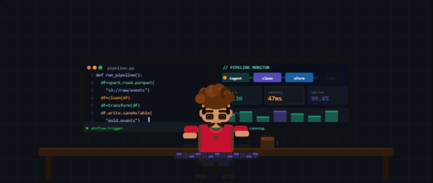

# Hi, I'm Achik 👋

aka ac0hik

Data Engineer · I love building things and I have a ton of fun doing it.

---

Just came back after a break — most of my recent work lived in external repos,
so this account's been quiet. Back now and ready to commit here too.

---

## 🛠 Tools

**Data Engineering**  

**Cloud & DevOps**  

**Databases**  

**AI & Web**  

---

